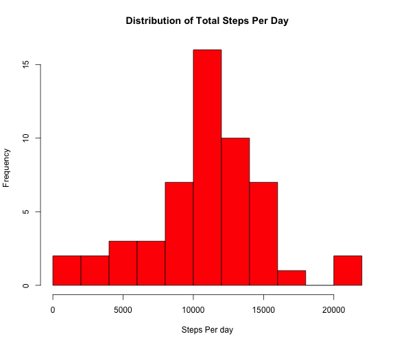
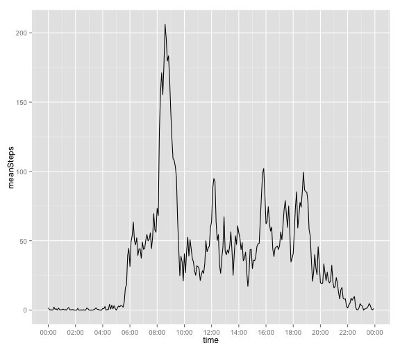
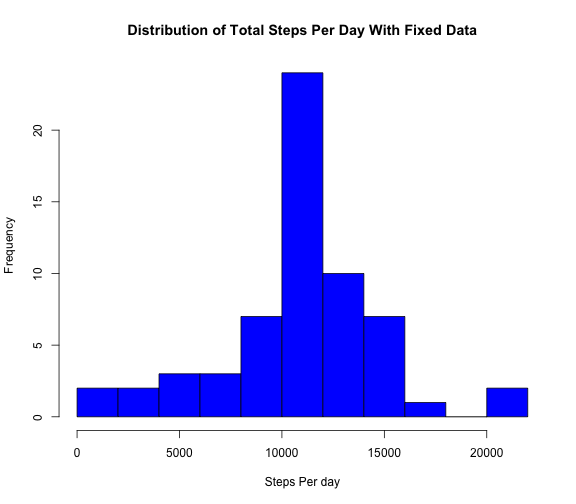
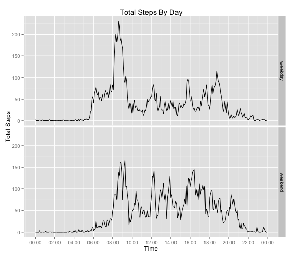

## Loading and preprocessing the data
Data is being loaded and processed here.  There is no meaningful output at this point.


```r
rm(list=ls())
library(lubridate)
library(ggplot2)
library(scales)
library(plyr)
library(tidyr)
library(dplyr)

if (!file.exists("activity.csv")){
  print("Unzipping Data")
  unzip("activity.zip", exdir=".")
  }

dat <- read.csv("activity.csv")
dat$date <- ymd(dat$date)
```


## What is mean total number of steps taken per day?

Looking at the number of steps we get the histogram below.  This shows a fairly normal distribution of steps per day with what appear to be some outliers of high activity.


```r
totalSteps <- as.numeric(tapply(dat$steps,dat$date,sum,na.rm=F))
day <- unique(dat$date)
byDay <- data.frame(day,totalSteps)
rm(list=c("day","totalSteps"))

hist(byDay$totalSteps[!is.na(byDay$totalSteps)], 
     breaks=10,
     xlab="Steps Per day",
     ylab="Frequency",
     main="Distribution of Total Steps Per Day",
     col="red")
```

 

```r
meanByDay <- mean(byDay$totalSteps,na.rm=T)
medianByDay <- median(byDay$totalSteps,na.rm=T)
```

The mean number of steps per day is 10766.19 while the median steps per day is 10765 steps.

## What is the average daily activity pattern?

If we take the average for each time period throughout the day, we see the time history below.  We can see a period of inactivity due to sleep, then a morning peak, then a medium activity level through the rest of the day.  This then trails off until sleep occurs again.


```r
byInterval <- ddply(dat,~interval,summarize,meanSteps=mean(steps,na.rm=T)) %>%
  mutate(hhmm = formatC(interval,width=4,flag="0")) %>%
  separate(hhmm,into=c("hr","min"),sep=2)
byInterval <- mutate(byInterval,time=min(dat$date)+minutes(min)+hours(hr))
# print(head(byInterval))

ggplot(byInterval, aes(x=time,y=meanSteps)) +
  geom_line() +
  scale_x_datetime(labels = date_format("%H:%M"), breaks = date_breaks("2 hour"))
```

 

```r
# find maximum line
maxPoint <- byInterval[byInterval$meanSteps==max(byInterval$meanSteps),]
maxTime <- strftime(maxPoint$time, format="%I:%M %p",tz="UTC")
```

On average the maximum steps per day occurs at 08:35 AM which is time interval 835.

## Imputing missing values

```r
# number of na's in all lines
colNAs <- colSums(is.na(dat))
totalNA <- sum(is.na(dat))
```

There are a total of 2304 missing values in the data set of 17568 observations.  If we apply the mean steps for any time interval that is missing with the mean for that time (from the above plot) then we get the distribution of steps per day below.


```r
# create new data set for fixe data
datFix <- dat

## replace NAs with mean of all days for that time interval
naRows <- which(is.na(dat$steps)) # which rows have NA
naIntervals <- dat$interval[naRows] # what are the intervals for these NA rows
# select mean values by matching missing interval with those in byInterval mean table 
datFix$steps[naRows] <- byInterval$meanSteps[match(naIntervals,byInterval$interval)] 

# make new daily sums
totalSteps <- as.numeric(tapply(datFix$steps,datFix$date,sum,na.rm=T))
day <- unique(dat$date)
byDayFix <- data.frame(day,totalSteps)
rm(list=c("day","totalSteps"))

hist(byDayFix$totalSteps[!is.na(byDayFix$totalSteps)], 
     breaks=10,
     xlab="Steps Per day",
     ylab="Frequency",
     main="Distribution of Total Steps Per Day With Fixed Data",
     col="blue")
```

 

```r
meanByDayFix <- mean(byDayFix$totalSteps,na.rm=T)
medianByDayFix <- median(byDayFix$totalSteps,na.rm=T)
```

Here we see that the distribution is essentially the same as when the missing data had not been fixed, as in part 1.  However the peak around the mean becomes more pronounced as the missing data points are being filled with mean values.  This would then just cause more values to fill the mean bin.

The mean number of steps per day for the fixed data is 10766.19 while the median steps per day is 10766.19 steps.  This is compared with the mean and median of 10766.19 and 10765 respectively for the unfixed data.  This shows the mean stays the same as mean data was added in to the missing data, but the median changed slightly.

## Are there differences in activity patterns between weekdays and weekends?

```r
weekends <- which(weekdays(datFix$date)=="Saturday"|weekdays(datFix$date)=="Sunday")
datFix$day <- weekdays(datFix$date)
datFix$weekday <- "weekday"
datFix$weekday[weekends] <- "weekend"

weekendSummary <- ddply(datFix,interval~weekday,summarize,meanSteps=mean(steps,na.rm=T)) %>%
  mutate(hhmm = formatC(interval,width=4,flag="0")) %>%
  separate(hhmm,into=c("hr","min"),sep=2) %>%
  mutate(time=min(dat$date)+minutes(min)+hours(hr))

ggplot(weekendSummary, aes(time, meanSteps)) +
  geom_line() + 
  facet_grid(weekday ~ .) +
  xlab("Time") + 
  ylab("Total Steps") + 
  ggtitle("Total Steps By Day") +
  scale_x_datetime(labels = date_format("%H:%M"), breaks = date_breaks("2 hour"))# +
```

 

```r
  #theme(axis.text.x  = element_text(angle=45, vjust=0.5, size=8))
```

From this we see a higher peak in the morning on weekdays.  However, on weekends, after rising later, the user maintains a marginally higher level of activity across the day.
